```mermaid
graph TB
    %% External Layer
    User[👤 User/Browser]
    LoadGen[🔄 Load Generator]
    
    %% Frontend Layer
    Frontend[🌐 Frontend Service<br/>Go - Port 8080<br/>Web UI & API Gateway]
    
    %% Core Business Services
    ProductCatalog[📦 Product Catalog Service<br/>Go - Port 3550<br/>Product Management]
    Cart[🛒 Cart Service<br/>C#/.NET - Port 7070<br/>Shopping Cart Management]
    Checkout[💳 Checkout Service<br/>Go - Port 5050<br/>Order Processing]
    Payment[💰 Payment Service<br/>Node.js - Port 50051<br/>Payment Processing]
    Shipping[📮 Shipping Service<br/>Go - Port 50051<br/>Shipping Calculations]
    Email[📧 Email Service<br/>Python - Port 8080<br/>Notifications]
    Currency[💱 Currency Service<br/>Node.js - Port 7000<br/>Currency Conversion]
    
    %% Additional Services
    Recommendation[🎯 Recommendation Service<br/>Python - Port 8080<br/>ML Recommendations]
    Ad[📢 Ad Service<br/>Java - Port 9555<br/>Contextual Ads]
    ShoppingAssistant[🤖 Shopping Assistant<br/>Python - Port 9000<br/>AI Assistant]
    
    %% Data Layer
    Redis[(🗄️ Redis Cache<br/>Port 6379<br/>Session & Cart Storage)]
    
    %% Observability & Infrastructure
    OTelCollector[📊 OpenTelemetry Collector<br/>Port 4317<br/>Metrics & Traces]
    
    %% User Interactions
    User -->|HTTP/HTTPS| Frontend
    LoadGen -->|Simulated Traffic| Frontend
    
    %% Frontend to Core Services
    Frontend -->|gRPC| ProductCatalog
    Frontend -->|gRPC| Cart
    Frontend -->|gRPC| Checkout
    Frontend -->|gRPC| Currency
    Frontend -->|gRPC| Shipping
    Frontend -->|gRPC| Recommendation
    Frontend -->|gRPC| Ad
    Frontend -->|gRPC| ShoppingAssistant
    
    %% Core Service Interactions
    Checkout -->|gRPC| ProductCatalog
    Checkout -->|gRPC| Cart
    Checkout -->|gRPC| Payment
    Checkout -->|gRPC| Shipping
    Checkout -->|gRPC| Currency
    Checkout -->|gRPC| Email
    
    Recommendation -->|gRPC| ProductCatalog
    
    %% Data Persistence
    Cart -->|TCP| Redis
    
    %% Observability
    Frontend -.->|Telemetry| OTelCollector
    ProductCatalog -.->|Telemetry| OTelCollector
    Cart -.->|Telemetry| OTelCollector
    Checkout -.->|Telemetry| OTelCollector
    Payment -.->|Telemetry| OTelCollector
    Shipping -.->|Telemetry| OTelCollector
    Email -.->|Telemetry| OTelCollector
    Currency -.->|Telemetry| OTelCollector
    Recommendation -.->|Telemetry| OTelCollector
    Ad -.->|Telemetry| OTelCollector
    
    %% Service Dependencies in Docker Network
    Frontend -.->|depends_on| ProductCatalog
    Frontend -.->|depends_on| Currency
    Frontend -.->|depends_on| Cart
    Frontend -.->|depends_on| Shipping
    Frontend -.->|depends_on| Checkout
    
    Checkout -.->|depends_on| ProductCatalog
    Checkout -.->|depends_on| Shipping
    Checkout -.->|depends_on| Payment
    Checkout -.->|depends_on| Email
    Checkout -.->|depends_on| Currency
    Checkout -.->|depends_on| Cart
    
    Cart -.->|depends_on| Redis
    
    %% Styling
    classDef userLayer fill:#e1f5fe,stroke:#01579b,stroke-width:2px
    classDef frontendLayer fill:#f3e5f5,stroke:#4a148c,stroke-width:2px
    classDef businessLayer fill:#e8f5e8,stroke:#1b5e20,stroke-width:2px
    classDef dataLayer fill:#fff3e0,stroke:#e65100,stroke-width:2px
    classDef infraLayer fill:#fce4ec,stroke:#880e4f,stroke-width:2px
    
    class User,LoadGen userLayer
    class Frontend frontendLayer
    class ProductCatalog,Cart,Checkout,Payment,Shipping,Email,Currency,Recommendation,Ad,ShoppingAssistant businessLayer
    class Redis dataLayer
    class OTelCollector infraLayer
```

## 🏗️ Architecture Overview

### **Frontend Layer**
- **Frontend Service (Go)**: Single entry point serving the web UI and acting as an API gateway
- Handles user authentication, session management, and routes requests to backend services

### **Core Business Services**
1. **Product Catalog Service (Go)**: Manages product inventory, search, and details
2. **Cart Service (C#/.NET)**: Handles shopping cart operations with Redis backend
3. **Checkout Service (Go)**: Orchestrates the entire checkout process
4. **Payment Service (Node.js)**: Processes payment transactions
5. **Shipping Service (Go)**: Calculates shipping costs and methods
6. **Email Service (Python)**: Sends order confirmations and notifications
7. **Currency Service (Node.js)**: Handles currency conversion with real-time rates

### **Enhanced Services**
- **Recommendation Service (Python)**: ML-powered product recommendations
- **Ad Service (Java)**: Contextual advertisement delivery
- **Shopping Assistant (Python)**: AI-powered shopping assistance

### **Data Layer**
- **Redis Cache**: High-performance caching for cart sessions and temporary data

### **Communication Patterns**
- **gRPC**: Inter-service communication for high performance
- **HTTP/REST**: Frontend-to-user communication
- **Protocol Buffers**: Service interface definitions

### **Key Features**
✅ **Microservices Architecture**: Loosely coupled, independently deployable services  
✅ **Multi-language Support**: Go, C#, Node.js, Python, Java  
✅ **Cloud-Native**: Docker containerized with Kubernetes support  
✅ **Observability**: OpenTelemetry integration for monitoring  
✅ **Scalable**: Horizontal scaling capabilities  
✅ **Resilient**: Health checks and circuit breaker patterns  

### **Network Configuration**
- All services communicate via Docker's internal network
- Service discovery through container names
- Load balancing and service mesh ready (Istio support)
- External access through Frontend service only

This architecture follows microservices best practices with clear separation of concerns, making it suitable for production e-commerce workloads.
